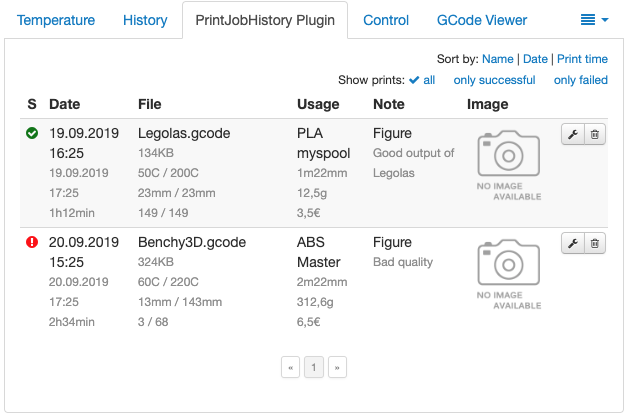
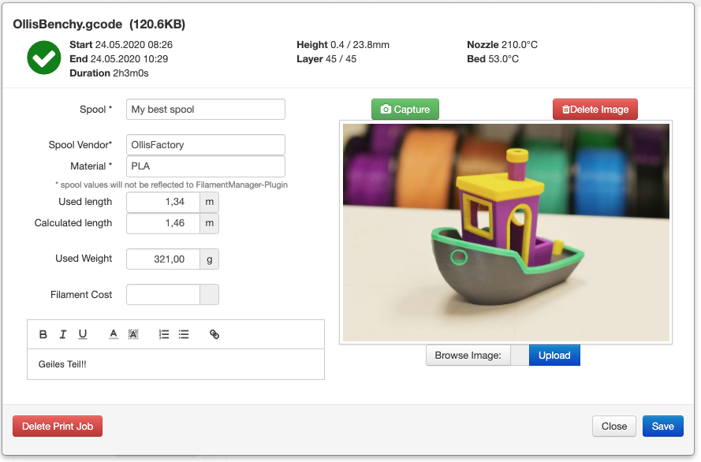
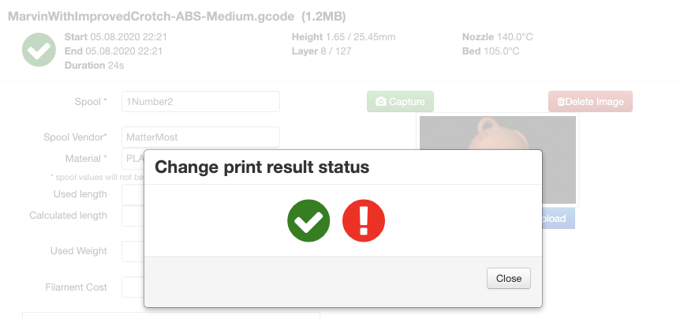
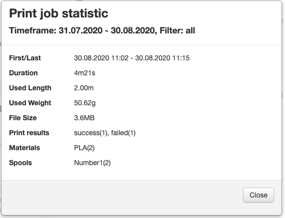
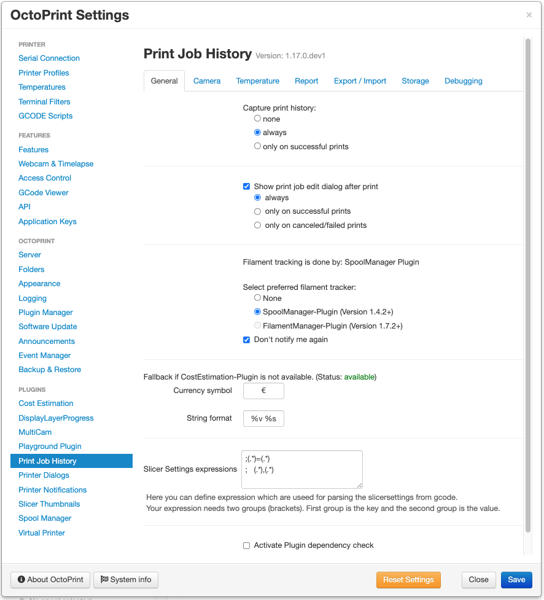
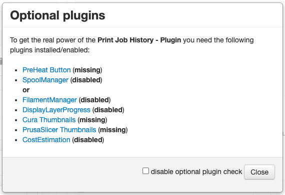

# OctoPrint-PrintJobHistory

The OctoPrint-Plugin stores all print-job informations of a print in a local database.
These informations were collected from OctoPrint itself, but also from other plugins. See [below](#Optional-Plugins) for more information about these plugins.

#### Support my Efforts

This plugin, as well as my [other plugins](https://github.com/OllisGit/) were developed in my spare time.
If you like it, I would be thankful about a cup of coffee :)

## Included features

- [x] Print result (success, fail, cancel)
- [x] Start/End datetime -> duration
- [x] Temperatures Bed/Extruder -> HINT: Only single Extruder-Temperature is currently collected. Selectable Tool
- [x] Username
- [x] Filename, filesize
- [x] Note (WYSIWYG-Editor)
- [x] Image (single Image)
- [x] Printed Layers/Height
- [x] Spoolname
- [x] Material
- [x] Used/Calculated length
- [x] Used weight
- [x] Filament cost
- [x] Slicer Settings (look [here](https://github.com/OllisGit/OctoPrint-PrintJobHistory/wiki/Slicer-Settings) for "how to use it")
- [x] Export all data from PrintHistory-Plugin as CSV

### UI features
- [x] List all printjobs
- [x] Edit single printjob
- [x] Add single printjob
- [x] Capture/Upload Image
- [x] Filter history table
- [x] Sort history table
- [x] Table column visibility
- [x] Capture image after print
- [x] Take Thumbnail from [Cura Thumbnails](https://plugins.octoprint.org/plugins/UltimakerFormatPackage/) and [PrusaSlicer Thumbnails](https://plugins.octoprint.org/plugins/prusaslicerthumbnails/)
- [x] Export all printjobs as CSV
- [x] Import printjobs from CSV
- [x] Compare Slicer-Settings

### Not included
- No report diagramms

## Optional Plugins

- [PreHeat](https://plugins.octoprint.org/plugins/preheat/)
    - Starting Temperature
- [CostEstimation](https://plugins.octoprint.org/plugins/costestimation/)
    - Added the estimated costs to a print job
- [SpoolManager](https://plugins.octoprint.org/plugins/SpoolManager/)
    - Spool Management
- [FillamentManager](https://plugins.octoprint.org/plugins/filamentmanager/)
    - Spool - Informations
- [DisplayLayerProgress](https://plugins.octoprint.org/plugins/DisplayLayerProgress/)
    - Layer and Height
- [Cura-Thumbnails](https://plugins.octoprint.org/plugins/UltimakerFormatPackage/)
    - Thumbnail
- [PrusaSlicer-Thumbnail](https://plugins.octoprint.org/plugins/prusaslicerthumbnails/)
    - Thumbnail

## Screenshots

## Setup

Install via the bundled [Plugin Manager](http://docs.octoprint.org/en/master/bundledplugins/pluginmanager.html)
or manually using this URL:

    https://github.com/OllisGit/OctoPrint-PrintJobHistory/releases/latest/download/master.zip

## Roadmap

see [Planning-Board](https://github.com/OllisGit/OctoPrint-PrintJobHistory/projects/1)

## Versions

see [Release-Overview](https://github.com/OllisGit/OctoPrint-PrintJobHistory/releases/)

