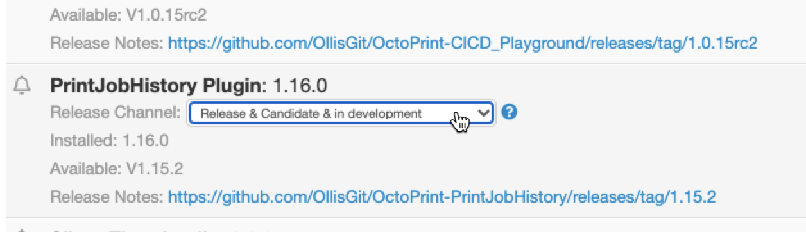

# OctoPrint-PrintJobHistory

[]()
[]()


The OctoPrint-Plugin stores all print-job information of a print in a local database.
This information is collected from OctoPrint itself, but also from other plugins. See [below](#Optional-Plugins) for more information about these plugins.

#### *NOTE: this plugin has been abandoned by the original creator and adopted here by a new maintainer*

**This plugin is under new management** and will focus on critical bug fixes to start. Please bear with me as I get acclimated to this new plugin. If you would like to support these new efforts, please consider buying me a coffee or two. Thank you!

<a href="https://www.buymeacoffee.com/djohnson.tech" target="_blank"></a>

## Included features

- [x] Print result (success, fail, cancel)
- [x] Start/End datetime -> duration
- [x] Temperatures Bed/Extruder -> HINT: Only single Extruder-Temperature is currently collected. Selectable Tool
- [x] Username
- [x] Filename, filesize
- [x] Note (WYSIWYG-Editor)
- [x] Image (single Image)
- [x] Printed Layers/Height
- [x] Spoolname
- [x] Material
- [x] Used/Calculated length
- [x] Used weight
- [x] Filament cost
- [x] Slicer Settings (look [here](https://github.com/dojohnso/OctoPrint-PrintJobHistory/wiki/Slicer-Settings) for "how to use it")
- [x] Export all data from PrintHistory-Plugin as CSV

### UI features
- [x] List all printjobs
- [x] Edit single printjob
- [x] Add single printjob
- [x] Capture/Upload Image
- [x] Filter history table
- [x] Sort history table
- [x] Table column visibility
- [x] Capture image after print
- [x] Take Thumbnail from [Cura Thumbnails](https://plugins.octoprint.org/plugins/UltimakerFormatPackage/) and [PrusaSlicer Thumbnails](https://plugins.octoprint.org/plugins/prusaslicerthumbnails/)
- [x] Export all printjobs as CSV
- [x] Import printjobs from CSV
- [x] Compare Slicer-Settings

### Not included
- No report diagramms

## Optional Plugins

- [PreHeat](https://plugins.octoprint.org/plugins/preheat/)
    - Starting Temperature
- [CostEstimation](https://plugins.octoprint.org/plugins/costestimation/)
    - Added the estimated costs to a print job
- [SpoolManager](https://plugins.octoprint.org/plugins/SpoolManager/)
    - Spool Management
- [FillamentManager](https://plugins.octoprint.org/plugins/filamentmanager/)
    - Spool - Informations
- [DisplayLayerProgress](https://plugins.octoprint.org/plugins/DisplayLayerProgress/)
    - Layer and Height
- [Cura-Thumbnails](https://plugins.octoprint.org/plugins/UltimakerFormatPackage/)
    - Thumbnail
- [PrusaSlicer-Thumbnail](https://plugins.octoprint.org/plugins/prusaslicerthumbnails/)
    - Thumbnail

## Screenshots


## Setup

Install via the bundled [Plugin Manager](http://docs.octoprint.org/en/master/bundledplugins/pluginmanager.html)
or manually using this URL:

    https://github.com/dojohnso/OctoPrint-PrintJobHistory/releases/latest/download/main.zip

After installation, you can listen on three release channels (since 1.6.0).
What does this mean: Each channel has its own release-version and each release has a different kind of functionality and stability.

- **"Only Release"**: Only stable and tested versions will be shown in the software-update section of OctoPrint
- **"Release & Candidate"**: Beside the stable release, you can also see the "release-candidates", like '''1.7.0rc3'''.
  The rc's includde new functionalty/bugfixes and are already tested by the community.. so by YOU ;-)
- **"Release & Candidate & in Development"**: Beside stable and rc, you will be informed about development versions.
  A development version like '''1.8.0.dev5``` could include a new (experimental) feature/bugfixs, but it is not fully tested by the community

Changing between each release is done via the "Software Update section" in the settings.


**!!! If you use the development-channel, you can use the latest feature and can improve the quality of the plugin !!!**

Hint: "Easy-switching" is possible with OctoPrint-Version 1.8.0 (see https://github.com/OctoPrint/OctoPrint/issues/4238).
At the meantime you need to uninstall and install the version you like from the selected channel...or stay in one channel ;-)


## Roadmap

TBD. Critical bug fixes for starters. Submit issues to the repo [here](https://github.com/dojohnso/OctoPrint-PrintJobHistory/issues).

## Versions

see [Release-Overview](https://github.com/dojohnso/OctoPrint-PrintJobHistory/releases/)


